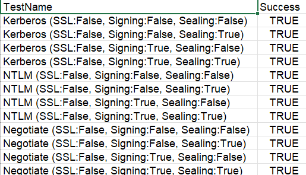

# LDAP Security Configuration Tester

## Demo

**Watch the Tool in Action:**

<video width="720" autoplay muted loop controls>
  <source src="LDAP_SECURITY_TESTER_DEMO.mp4" type="video/mp4">
  Your browser does not support the video tag.
</video>

*[Click here to download the demo video](LDAP_SECURITY_TESTER_DEMO.mp4) if it doesn't play automatically.*

**Example CSV Output:**



## Overview

A comprehensive tool for testing and validating LDAP security configurations across different authentication methods, signing, and sealing options. This tool helps security professionals and system administrators assess their Active Directory LDAP security posture.

## What This Tool Tests

### LDAP Security Assessment
This tool performs comprehensive security testing of LDAP connections to validate:

- **Authentication Method Support**: Tests which authentication protocols are accepted
- **Message Integrity Protection**: Validates LDAP signing requirements and enforcement
- **Message Confidentiality**: Tests LDAP sealing (encryption) capabilities
- **Transport Layer Security**: Verifies SSL/TLS (LDAPS) configuration
- **Policy Compliance**: Checks against domain security policies

### Security Scenarios Tested

The tool generates a matrix of test cases covering:

1. **Authentication Types**:
   - **Kerberos**: Modern ticket-based authentication (preferred)
   - **NTLM**: Legacy challenge-response authentication
   - **Negotiate**: Automatic selection between Kerberos and NTLM
   - **Basic**: Simple username/password (requires SSL/TLS)

2. **Message Security Combinations**:
   - No signing, no sealing (insecure baseline)
   - Signing only (integrity protection)
   - Sealing only (confidentiality protection)
   - Both signing and sealing (full protection)

3. **Transport Security**:
   - Plain LDAP (port 389)
   - LDAPS with SSL/TLS (port 636)

## Understanding LDAP Signing and Sealing

### LDAP Signing (Message Integrity)
**What it is**: Cryptographic signatures applied to LDAP messages using the negotiated security context (Kerberos, NTLM, or Negotiate).

**Purpose**: 
- Prevents tampering with LDAP messages in transit
- Protects against man-in-the-middle attacks that modify search results
- Ensures message authenticity and integrity

**When to use**: Always recommended for production environments to prevent LDAP injection and data manipulation attacks.

### LDAP Sealing (Message Confidentiality)
**What it is**: Encryption of LDAP message contents using the negotiated security context.

**Purpose**:
- Encrypts sensitive data in LDAP queries and responses
- Protects credentials during SASL authentication flows
- Prevents network sniffing of directory information

**When to use**: Required when transmitting sensitive directory data over untrusted networks, or when LDAPS is not available.

### Security Policy Implications

**Domain Controllers can enforce**:
- **Signing Required**: Reject all unsigned LDAP connections
- **Sealing Required**: Reject all unsealed LDAP connections
- **SSL/TLS Required**: Reject plain-text LDAP connections

**Client-side policies** (Windows registry):
- `LDAPClientIntegrity = 0`: No signing required (default)
- `LDAPClientIntegrity = 1`: Negotiate signing when possible
- `LDAPClientIntegrity = 2`: Require signing for all LDAP connections

## Common Attack Scenarios This Tool Helps Detect

1. **LDAP Injection Attacks**: Unsigned connections allow message tampering
2. **Credential Sniffing**: Unsealed basic authentication exposes passwords
3. **Directory Information Disclosure**: Plain-text LDAP reveals sensitive data
4. **Man-in-the-Middle Attacks**: Unsigned connections allow response modification


## Installation and Usage

### Prerequisites
- .NET 9.0 Runtime or SDK
- Network access to target domain controller
- Valid domain credentials (if testing authenticated scenarios)

### Basic Usage
```bash
# Test against a domain controller
LdapSecurityTester --dc mydc.domain.com --domain MYDOMAIN

# With specific user credentials (will prompt for password)
LdapSecurityTester --dc mydc.domain.com --domain MYDOMAIN --user testuser

# SSL/TLS testing only
LdapSecurityTester --dc mydc.domain.com --domain MYDOMAIN --ssl
```

### Command-Line Options

#### Required Parameters
- `--dc, --domain-controller <HOST>` - Domain controller hostname or IP address
- `--domain, -D <DOMAIN>` - Domain name (e.g., CONTOSO)

#### Authentication Options
- `--user, -u <USERNAME>` - Username for authentication (prompts if needed)
- `--password, -p <PASSWORD>` - Password (prompts securely if not provided)

#### Test Configuration
- `--auth-types <TYPES>` - Authentication types: Kerberos,NTLM,Negotiate,Basic (default: Kerberos,NTLM,Negotiate)
- `--ssl` - Test LDAPS (SSL/TLS) connections instead of plain LDAP
- `--require-signing` - Force signing for all tests
- `--require-sealing` - Force sealing for all tests
- `--test-signing` - Test both signed and unsigned variants (default: true)
- `--test-sealing` - Test both sealed and unsealed variants (default: true)

#### Connection Options
- `--ldap-port <PORT>` - LDAP port (default: 389)
- `--ldaps-port <PORT>` - LDAPS port (default: 636)
- `--timeout <SECONDS>` - Connection timeout (default: 30)

#### Execution Options
- `--parallel <COUNT>` - Concurrent test execution (default: 1)
- `--no-pause` - Non-interactive mode for automation
- `--verbose, -v` - Detailed logging output

#### Output Options
- `--output-format <FORMAT>` - Export format: csv, json (default: csv)
- `--output-path <PATH>` - Custom output file path

### Advanced Examples

#### Security Audit (Full Assessment)
```bash
LdapSecurityTester --dc dc01.contoso.com --domain CONTOSO \
  --user administrator --verbose \
  --output-path security-audit-$(date +%Y%m%d).csv
```

#### Automated Testing (CI/CD Pipeline)
```bash
LdapSecurityTester --dc dc01.contoso.com --domain CONTOSO \
  --no-pause --parallel 4 \
  --output-path ldap-security-test.csv
```

#### SSL/TLS Only Assessment
```bash
LdapSecurityTester --dc dc01.contoso.com --domain CONTOSO \
  --ssl --require-signing --require-sealing
```

#### Specific Authentication Testing
```bash
LdapSecurityTester --dc dc01.contoso.com --domain CONTOSO \
  --auth-types Kerberos --test-signing --test-sealing
```

## Output and Reporting

### CSV Report Contents
- **Test Configuration**: Authentication type, signing/sealing settings, SSL usage
- **Test Results**: Success/failure status with detailed error messages
- **Performance Data**: Connection timing and test duration
- **Sample Data**: Retrieved directory objects (computers) for connection validation
- **Metadata**: Timestamps, test parameters, and execution context

### Registry Policy Display
On Windows systems, the tool displays current LDAP client security policies:
- LDAP Client Integrity settings
- Current policy enforcement levels
- Recommendations for hardening


## Building from Source

```bash
dotnet build
dotnet run -- --dc mydc.domain.com --domain MYDOMAIN

# Create standalone executable
dotnet publish -c Release -r win-x64 --self-contained
```

# LDAP Security Configuration Checker (PowerShell Script) 

### Overview
The `LdapSecConfig.ps1` PowerShell script provides a quick way to audit the current LDAP security configuration on both domain controllers and client machines. It reads Windows registry settings that control LDAP signing, sealing, and channel binding requirements.

### What It Checks

#### Server-Side Settings (Domain Controllers)
- **LDAPServerIntegrity**: Controls whether the DC requires signed LDAP connections
  - `0` = None - Unsigned LDAP permitted (INSECURE)
  - `1` = Negotiate - Signed LDAP preferred (MODERATE)
  - `2` = Required - Signed LDAP enforced (MOST SECURED)

- **ldapserverenforceintegrity**: Enforcement override for signing requirements
  - `0` = Disabled - Uses LDAPServerIntegrity value
  - `1` = Enabled - Signed LDAP always enforced (overrides LDAPServerIntegrity)

- **LdapEnforceChannelBinding**: Controls LDAPS channel binding token requirements
  - `0` = Never - Not enforced (INSECURE)
  - `1` = When Supported - Enforced when client supports it (MODERATE)
  - `2` = Always - Always enforced (MOST SECURED)

#### Client-Side Settings (Any Windows Machine)
- **LDAPClientIntegrity**: Controls whether the client requires signed LDAP
  - `0` = None - Unsigned LDAP allowed (INSECURE)
  - `1` = Negotiate - Signed LDAP preferred (default, MODERATE)
  - `2` = Require - Signed LDAP enforced (MOST SECURED)

- **LDAPClientConfidentiality**: Controls whether the client requires encrypted LDAP (sealing)
  - `0` = No encryption (INSECURE)
  - `1` = Encryption when supported (default)
  - `2` = Required encryption (MOST SECURED)

### How to Use

#### Prerequisites
- Windows PowerShell 5.1 or later
- Administrator privileges (for reading registry)
- Run on domain controller for server settings
- Run on any Windows machine for client settings

#### Running the Script
```powershell
# On a Domain Controller - checks both server and client settings
.\LdapSecConfig.ps1

# On a client machine - checks only client settings
.\LdapSecConfig.ps1
```

### Example Output
```
Server validation:
LDAPSigning                          LDAPChannelBinding                      LDAPSigningValue LDAPChannelBindingValue LDAPEnforceSigningValue
-----------                          ------------------                      ---------------- ----------------------- -----------------------
Required - Signed LDAP enforced      Always - Channel Binding always enforced               2                       2                       1

Client validation:
LDAP Client Confidentiality Setting: Required encryption (MOST SECURED)
LDAP Client Integrity Setting: Require - Signed LDAP enforced (MOST SECURED)
```

### When to Use This Script

1. **Before Running LdapSecurityTester**: Understand current server policies to predict test results
2. **Security Audits**: Quickly assess LDAP security posture across multiple machines
3. **Compliance Checks**: Verify that hardening policies are correctly applied
4. **Troubleshooting**: Diagnose why certain LDAP connections are failing or succeeding
5. **Pre-Deployment Validation**: Ensure clients meet security requirements before connecting

### Interpreting Results

#### Secure Configuration (Recommended)
```
Server: LDAPServerIntegrity = 2 (Required)
Server: ldapserverenforceintegrity = 1 (Enabled)
Server: LdapEnforceChannelBinding = 2 (Always)
Client: LDAPClientIntegrity = 2 (Require)
Client: LDAPClientConfidentiality = 2 (Required)
```

#### Moderate Configuration (Default)
```
Server: LDAPServerIntegrity = 1 (Negotiate)
Server: ldapserverenforceintegrity = 0 (Disabled)
Server: LdapEnforceChannelBinding = 1 (When Supported)
Client: LDAPClientIntegrity = 1 (Negotiate)
Client: LDAPClientConfidentiality = 1 (When Supported)
```

#### Insecure Configuration (Vulnerable)
```
Server: LDAPServerIntegrity = 0 (None)
Server: LdapEnforceChannelBinding = 0 (Never)
Client: LDAPClientIntegrity = 0 (None)
Client: LDAPClientConfidentiality = 0 (None)
```

### Registry Paths
The script reads from these locations:
- **Server**: `HKEY_LOCAL_MACHINE\System\CurrentControlSet\Services\NTDS\Parameters`
- **Client**: `HKEY_LOCAL_MACHINE\System\CurrentControlSet\Services\ldap`

### Note on Enforcement Hierarchy
The `ldapserverenforceintegrity` setting overrides `LDAPServerIntegrity`. If enforce is enabled (1), signing is always required regardless of the LDAPServerIntegrity value. This was introduced to allow default signing without breaking compatibility.

# Security Best Practices

### Recommended Configuration
1. **Enable LDAP Signing**: Prevents message tampering
2. **Use LDAPS**: Provides transport-layer encryption
3. **Disable Basic Auth over Plain LDAP**: Prevents credential exposure
4. **Enforce Client-Side Signing**: Set `LDAPClientIntegrity = 2`
5. **Monitor Test Results**: Regular security posture validation

# Contributing

Contributions are welcome! Please follow these guidelines:
- Follow C# coding conventions and SOLID principles
- Include unit tests for new functionality
- Update documentation for new features
- Test against multiple Active Directory versions

# License

This project is licensed under the **MIT License** - see the [LICENSE](LICENSE) file for details.

### Why MIT License?
- **Permissive**: Allows commercial and private use
- **GitHub-friendly**: Widely recognized and accepted
- **No warranty concerns**: Clear liability disclaimers
- **Enterprise-compatible**: No copyleft restrictions

## Disclaimer

This tool is intended for authorized security testing and assessment purposes only. Users are responsible for:
- Obtaining proper authorization before testing
- Complying with applicable laws and regulations
- Using the tool responsibly in production environments
- Understanding the security implications of test results

The authors assume no liability for misuse or damage caused by this tool.
